# Tutorial patrones Arquitecturales

En el siguiente tutorial se encontrará como se crean diferentes servicios en la pltaforma de aws 
desde el depliegue de paginas estaticas hasta el de una aplicacion web conectada a una base de datos.

Si se desea ver el tutorial en video seleccione el sigueinte link [link-youtube]()

# S3
Primero abriremos la consola de AWS y seleccioanremos la opcion de S3 en la categoria de storage

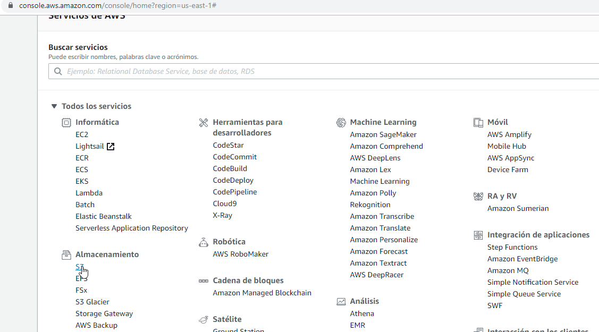

pasamos a crear un nuevo bucket colocando el nombre que se desee realizar,  para este caso sera el de patrones arquitecturales

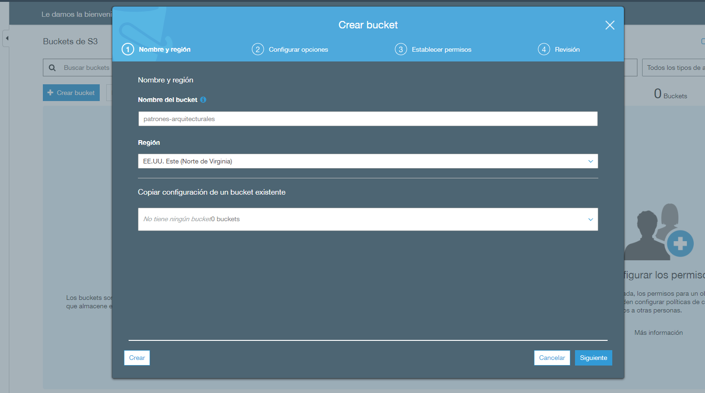

En la opcion de seguridad, debemos quitar lo de bloquear todo acceso publico

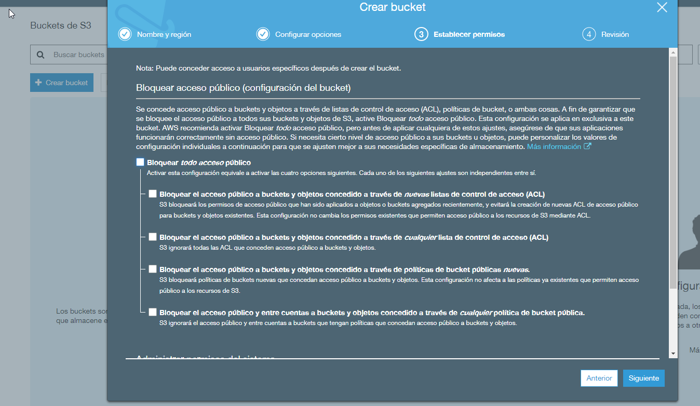

Por ultimo, esta la revison para ver toda la iformaciòn relevante hasta ahora.

Ahora, pasamos a abrir el bucket creado anteriormente y seleccinamos la opcion de cargar 

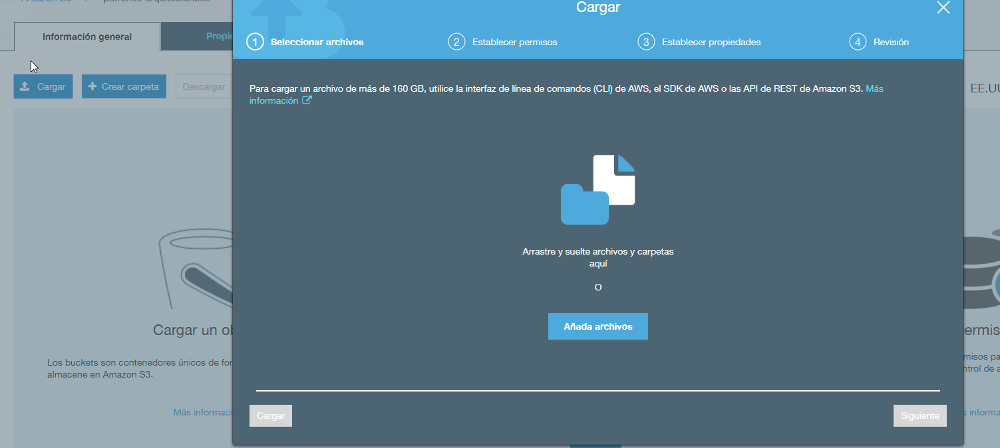

Se peude colocar en este sitio desde una imagen hasta una pagina web html con informacion estatica, para este caso elegimos el 
de subir una pagina web estatica.

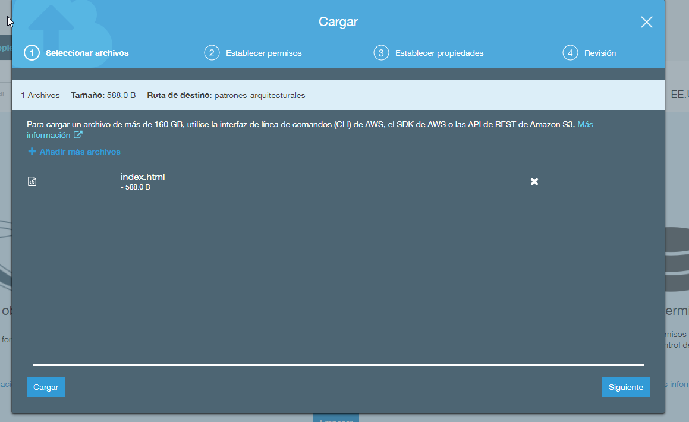

existen varias opciones, al momento de seleccionar las propiedades desde diferentes servicios hasta el cifrado del elemento subido,
como el fin es ilustrativo, se escoge la opcion gratiuta.

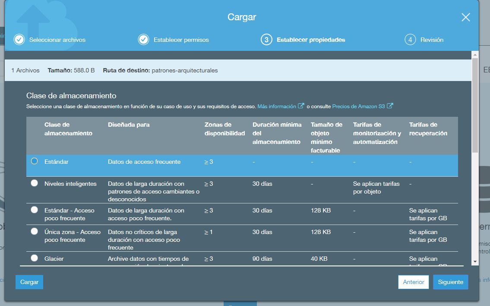

Por ultimo, debemos entrar a nuestro elemento cargado y seleccinamos la opcion de hacerlo publico

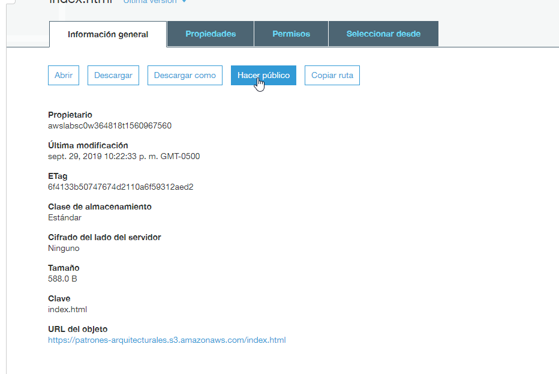

y ya podemos ver el sitio desplegado en un servicio s3 

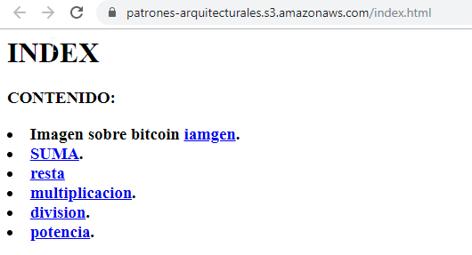

Nota: se pueden subir mas de un archivo, por lo que se podira crear una pagina web con diferentes pestañas, pero se deben subir cada uno de los archivos.

Para ver temas de costos asociados a este servicio por favro mirar el sigueinte link [CostosS3](https://aws.amazon.com/es/s3/pricing/)

# RDS

Antes de crear la base de datos, se debe realizar un grupo serguro dentro del servicio VPC

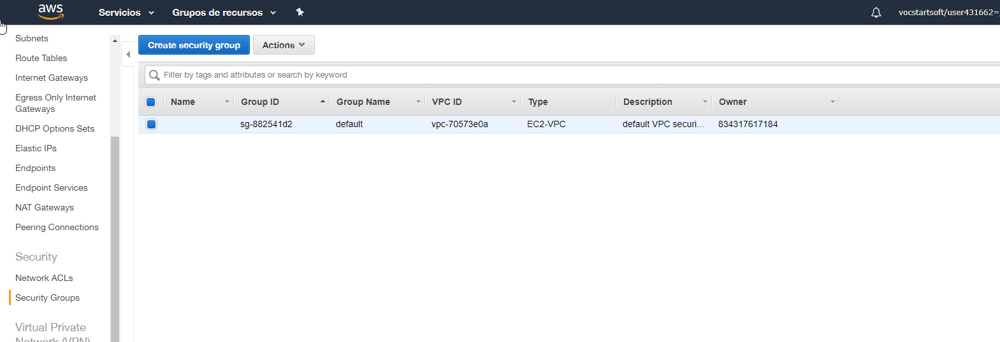

Pasamos a crear un grupo seguro colocando el nombre que deseamos y selecciando una vpc, por defecto se tiene una.

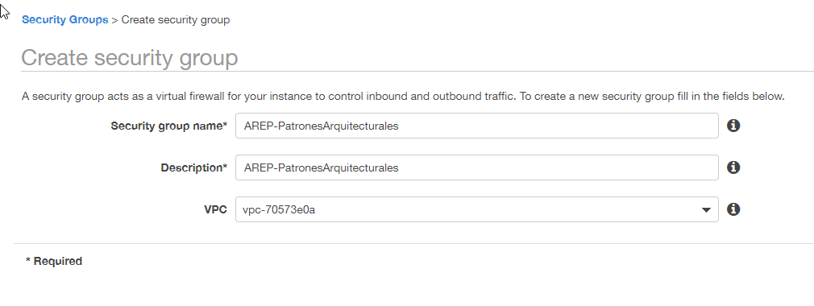

Se crea un inbound con el tipo que se desea, para este caso se coloca el de PostgreSQL, teniendo en cuenta que se coloca el source como anywhere.

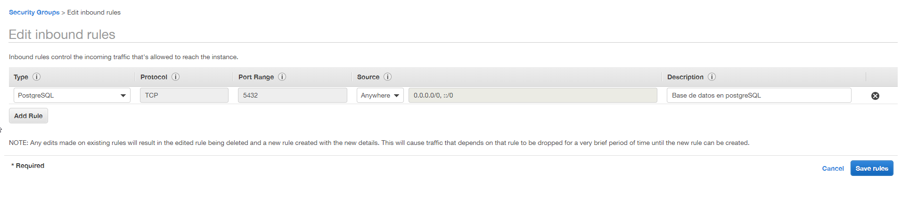

nota: Para ver temas de costos asociados a este servicio por favro mirar el sigueinte link [CostosVPC](https://aws.amazon.com/es/vpc/pricing/)

Pasamos luego a la creacion de la base de dato, seleccionamos el servicio RDS y seleccionamos crear base de datos

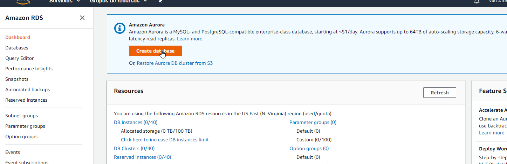

Y seleccionamos PostgreSQL 

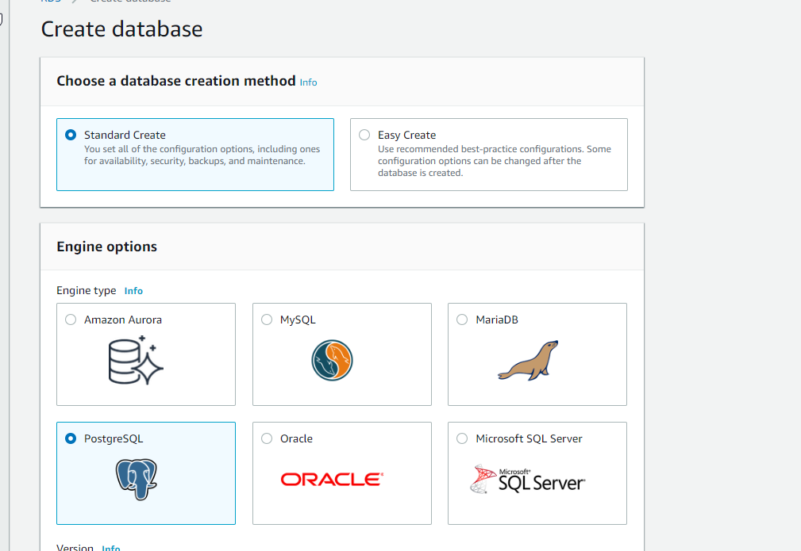

Agregamos usuario y clave para nuestra base de datos donde el usuario es admin y la contraseña admin12334

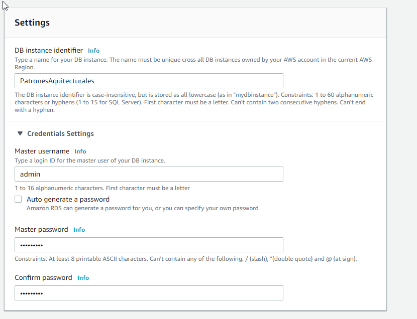

Pasamos a habilitar la opcion de security group que habiamos creado anteriromente

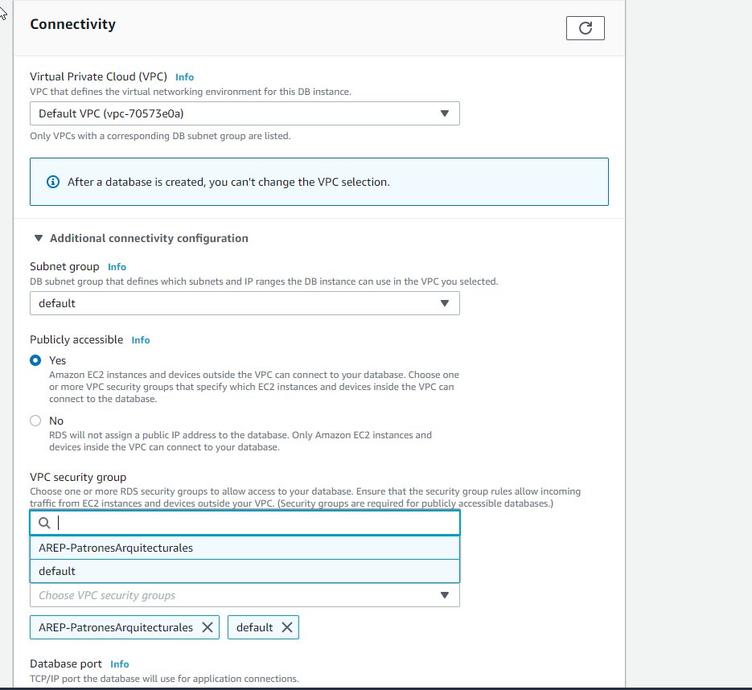

Por ultimo le damos la opcion de crear, para ver si esta funcionando, abrimos la base de datos en  dbeaver
Como podemos observar la base da datos fue creada 

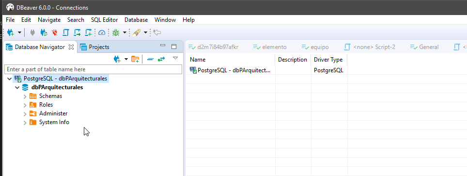

Creamos una tabla, que nos servira para el sigueinte punto.

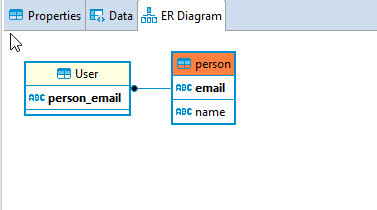

nota: Para ver temas de costos asociados a este servicio por favro mirar el sigueinte link [CostosRDS](https://aws.amazon.com/es/rds/pricing/)

# EC2

Nos dirigimos al servicio EC2 y le damos lanzar una instancia

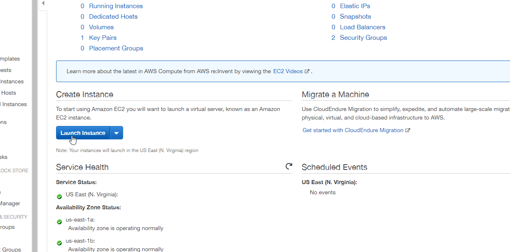

Seleccinamos la segunda opcion la cual nos permite lanzar una maquina linux con las especificaciones que veremos acontinuacion

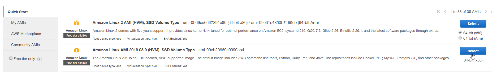

Seleccinamos la opcion gratuita para este ejemplo pero se puedne ver las demas opciones

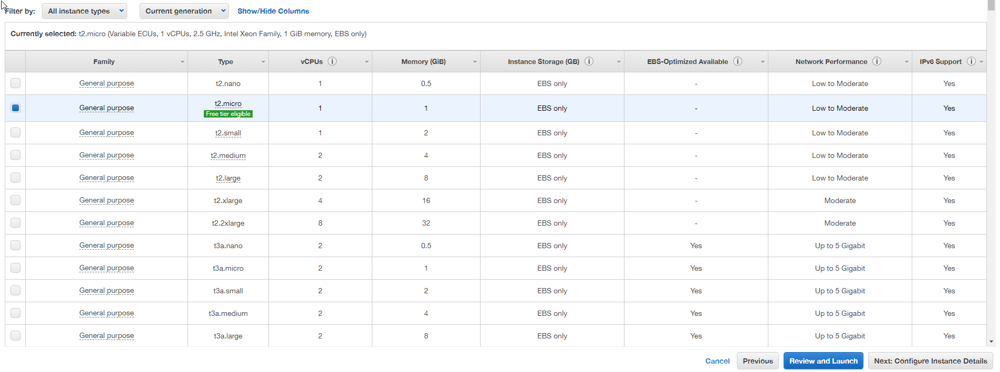

Pasamos luego a lanzar la instancia, pero antes nos pregunta cual es la llave que vmaos a seleccionar, como ya se tenia una llave se seleccina pero si 
es necesario crear una nueva desde ahi se peude realizar la opcion

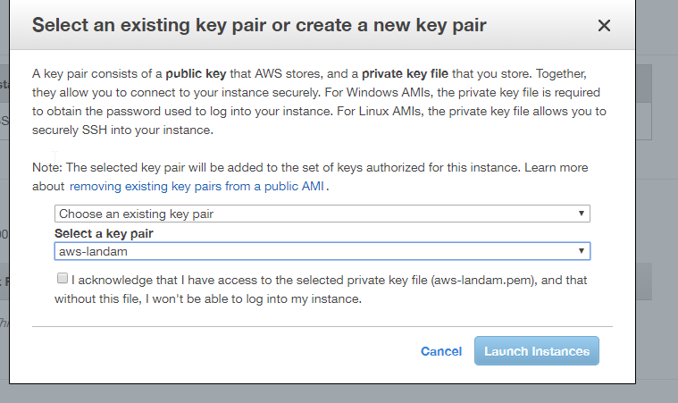

Se debe agregar el security group para esta maquian con el fin de que se puedan encontrar estos servicios
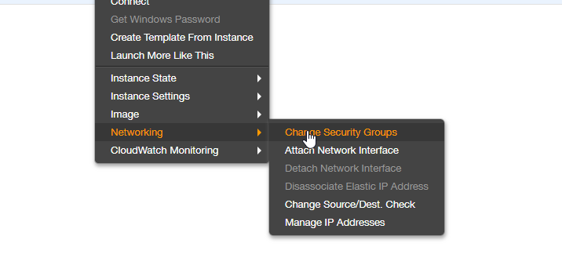

Por ultimo, se puede ver en la sigueinte imagen que la maquina ya ha sido creada y la direccion seleccianada es la que se va tener en cuenta cuando se lance la aplicaicon desde ahi 
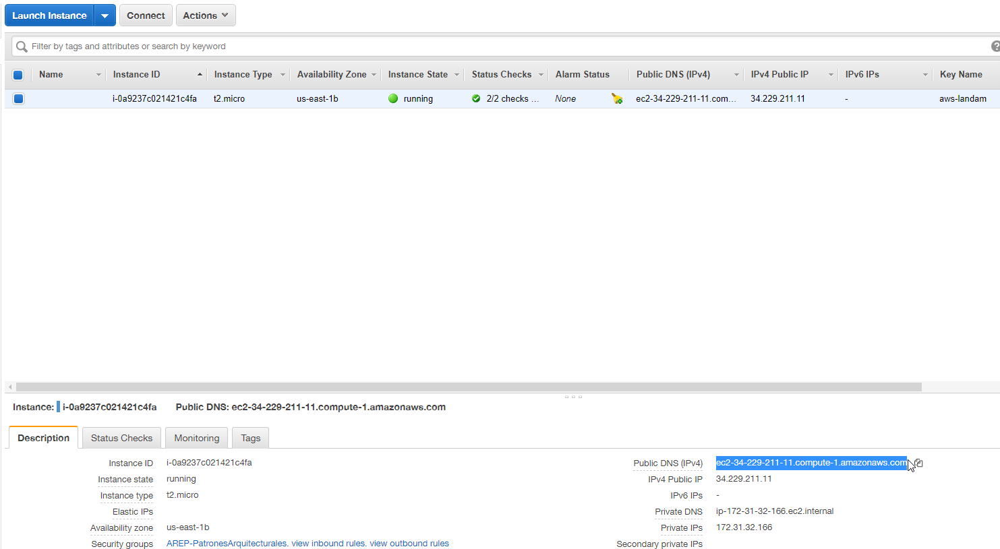

